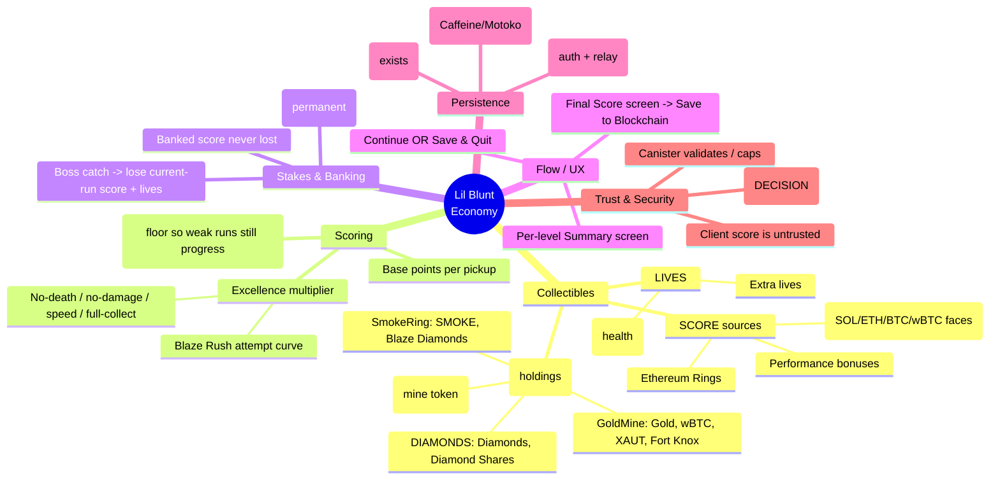
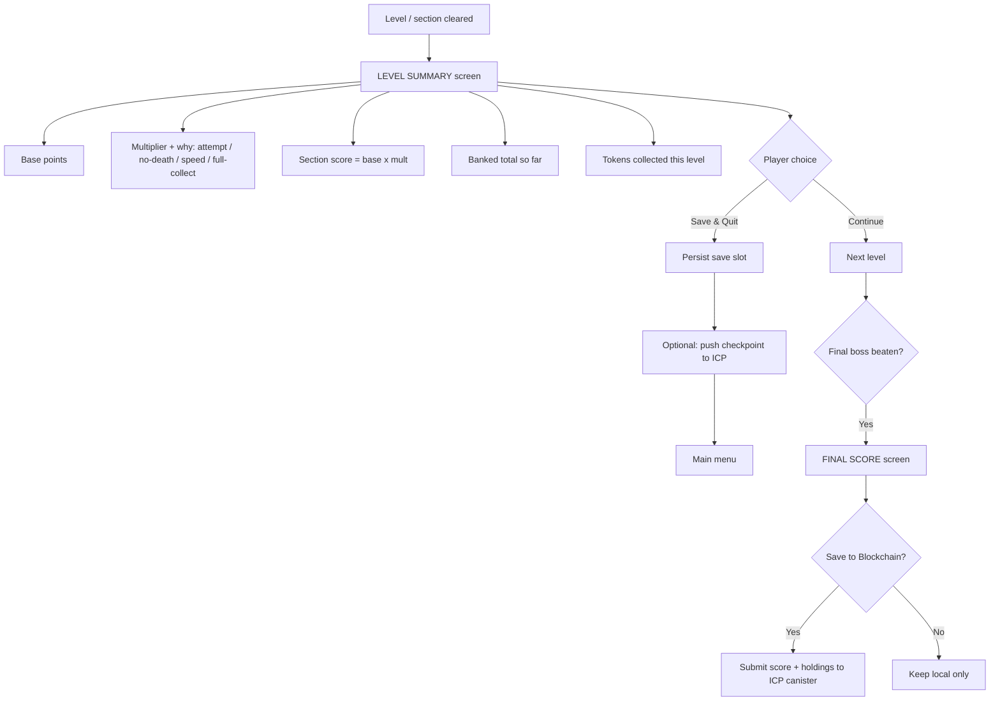
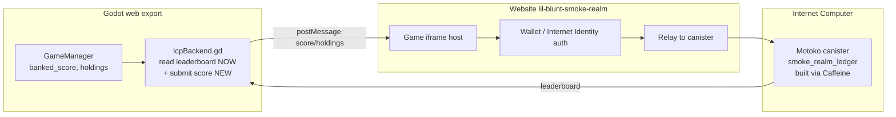

# Lil Blunt Adventure — Economy, Points & On-Chain (ICP) Design

**Status:** Proposed (design + mind map). Author: founder brief 2026-08-26.
**Scope:** One coherent points/token economy across the **game** (Godot, `GM-GAME`),
the **website** (`lil-blunt-smoke-realm`), and **ICP/Caffeine** on-chain storage.
**Grounded in the current code** — every existing field is named so we EXTEND
what's there, we don't reinvent it.

> This is the single source of truth. The paste-ready build plan is in
> `docs/design/CLAUDE_CODE_ECONOMY_WORKFLOW.md`. The visual mind map is the
> published Artifact linked from the founder chat.

---

## 0. The problem in one sentence

Coins, rings, protocol tokens, and lives are collected with **no unified rule**
for how they turn into a score, how excellence is rewarded, what survives a
death, and how any of it reaches the blockchain — this design defines all four.

---

## 1. Mind map (top level)



---

## 2. Token taxonomy — three classes (the core "systemize" ask)

The founder listed many currencies interchangeably ("Titanic = Diamond = Mine
tokens", plus SOL/ETH/BTC/wBTC coins, plus hearts). They are **not** one thing.
Split them into **three classes with different rules**:

| Class | What it is | In code today | Boss-catch behaviour | Goes on-chain? |
|------|-----------|---------------|----------------------|----------------|
| **A. SCORE** (run currency) | The competitive number that drives the multiplier + leaderboard | `total_score`, `coins_collected`, `ethereum_rings_collected` | **Current-run score lost**, banked kept | Yes — the leaderboard/record |
| **B. PROTOCOL TOKENS** (holdings / "your bag") | Crypto-themed collectibles tied to Rich's three projects | `smoke_collected`, `titanx_collected`, `GoldMineSystem.{gold,diamonds,wbtc,xaut,blaze_diamonds,fort_knox_shares}` | **Kept** (already the case) | Yes — a holdings snapshot |
| **C. LIVES** (resource) | Hearts / extra lives — survival, not score | `player_health`, `lives` | Current-run lives lost | No |

### 2a. Disambiguation the founder asked for
- **"Titanic / Diamond / Mine tokens"** are three *different* protocol tokens that
  the UI has blurred. Fix the language:
  - **TITANX** = `titanx_collected` — the Level-1 "mine token" (TitanX). Its own row.
  - **DIAMONDS** = `GoldMineSystem.diamonds_balance` — the DIAMONDS protocol token.
  - **GOLD / Mine** = `GoldMineSystem.gold_balance` — GoldMine's primary token.
  - "Mine tokens" as a *category* = TITANX + GOLD + DIAMONDS (the GoldMine/mining family).
- **Coins** (SOL / ETH / BTC / wBTC faces) are **SCORE sources with crypto flavour**
  — every coin face already routes through `crypto_coin.gd` and adds to `total_score`
  **and** credits one protocol HUD row. Keep that: a coin is *both* a point and a
  tiny protocol credit. Only **wBTC** and **XAUT** are true GoldMine holdings.
- **Ethereum Rings** = the premium SCORE pickup (worth more than a coin) + a DIAMONDS
  nod. Keep as high-value score.

### 2b. Canonical point values (data-driven — see `config.json` → new `economy` block)
Move these OUT of code into `config.json` so they are tunable without a rebuild
(CLAUDE.md rule: gameplay values are data-driven).

| Pickup | Base score | Protocol credit |
|--------|-----------:|-----------------|
| Coin (any face) | 10 | +1 to that face's protocol row |
| Ethereum Ring | 100 | +1 DIAMONDS-family |
| Gold token | 25 | +gold |
| wBTC | 250 | +wbtc |
| Diamond token | 50 | +diamonds |
| Health pickup | 0 | +1 heart (capped) |

---

## 3. Scoring & the excellence multiplier (the headline ask)

**Principle:** everyone banks the *base* points they earned; the **multiplier is
the excellence reward layered on top**, and it has a **floor** so a weak run still
makes fair progress. Nobody is ever zeroed for trying — the scale stays reasonable.

### 3a. Per-section score
```
section_score = round( base_points * excellence_multiplier )

base_points          = sum of pickup base scores in the section
excellence_multiplier = clamp( attempt_mult * bonus_mult , MULT_MIN , MULT_MAX )
```

### 3b. Blaze-Rush attempt curve (founder's explicit example)
Reward the first-try clear, decay per attempt to a fair floor:
```
attempt_mult = max( MULT_MIN , MULT_MAX - (attempts - 1) * ATTEMPT_STEP )

# suggested, all in config.json → economy.multiplier:
MULT_MAX      = 3.0     # first attempt
ATTEMPT_STEP  = 0.2     # each retry loses 0.2x
MULT_MIN      = 1.0     # 10th+ attempt still banks full base (never <1x)
```
So: attempt 1 → 3.0×, attempt 5 → 2.2×, attempt 10 → 1.2×, attempt 11+ → 1.0×.
The 10-attempt player still keeps **100% of base** — fair — while the ace gets **3×**.

### 3c. Excellence bonuses (stack multiplicatively, capped)
```
bonus_mult = 1
  * (NO_DEATH_BONUS   if cleared without dying)      # e.g. 1.25
  * (NO_DAMAGE_BONUS  if cleared without taking a hit)# e.g. 1.25
  * (SPEED_BONUS      if under the section par time)  # e.g. 1.15
  * (FULL_COLLECT_BONUS if all collectibles taken)    # e.g. 1.15
bonus_mult = min(bonus_mult, BONUS_CAP)   # e.g. 2.0
```
Combo (existing `ComboSystem`) can feed a small live score bump during play; the
end-of-section bonuses above are the durable reward.

### 3d. Fairness statement (put on the summary screen)
> "Base points are always yours. The multiplier rewards clean, fast, first-try
> play — but it never drops below 1×, so every clear counts."

---

## 4. Banking & stakes (founder's death rule, made precise)

Three running totals instead of one:

```
banked_score      # sum of COMPLETED levels' section_scores — PERMANENT, never lost
run_score         # points earned in the CURRENT (in-progress) level only
displayed_total   = banked_score + run_score   # what the HUD shows
```

Rules:
1. **Complete a level** → `banked_score += this level's run_score`; then `run_score = 0`
   for the next level. Banked is fixed forever (survives death, save, quit).
2. **Boss catches Lil Blunt** (`boss_contact_restart`) → **lose `run_score` and all
   current-run lives**; **`banked_score` is untouched**; restart the *current* level.
   (Today the code zeroes score but doesn't separate banked vs run — this split is
   the change.)
3. Protocol tokens (Class B) already survive — keep that.

This is the exact founder rule: *"he starts all over, losing all points and lives
he accumulated — but NOT the points from previous levels."*

---

## 5. Flow / UX — per-level summary + save/continue (new feature)



- **Level Summary**: a new `LevelSummary` scene shown by `StateMachine` on
  `LEVEL_COMPLETE`, before `SceneRouter` advances. Reads the three totals + the
  multiplier breakdown.
- **Continue / Save & Quit**: two buttons. "Save & Quit" calls the existing
  `GameManager.save_session()` (extend it with `banked_score`, per-level bests) and
  returns to menu; "Continue" advances via `SceneRouter`.
- **Resume**: main menu "Continue" already reads `highest_unlocked_level`; extend to
  restore `banked_score` and the per-level tally.
- **Final Score**: after the Claim Jumper dies, show the grand total + a **Save to
  Blockchain** button (Section 6).

---

## 6. Persistence & ICP / Caffeine architecture

Three storage tiers, already partly scaffolded (`icp_backend.gd`, `config.json.icp`,
`adr-icp-integration.md` — "Layer 4, additive, canister IDs empty until deployed").



- **Local save (tier 1, exists):** `save_session()`/`load_session()` JSON. Always the
  offline source of truth; the game is fully playable with zero chain.
- **ICP canister (tier 2, Caffeine builds it):** a **Motoko** canister
  `smoke_realm_ledger` storing per-principal: `banked_score`, per-level bests, a
  **holdings snapshot** (Class B tokens), and a **leaderboard**. Built and hosted via
  **Caffeine** (Motoko backend on ICP). Fill `config.json.icp.player_registry_canister_id`
  when deployed — until then everything degrades to local + Cloudflare, changing
  nothing at runtime (the ADR's rule).
- **Website bridge (tier 3):** the game is embedded on `lil-blunt-smoke-realm`. The
  **website owns the wallet / Internet Identity auth** and relays signed writes to the
  canister; the game **posts score/holdings out** via the sentinel-approved
  same-origin `window.parent.postMessage` pattern already used by
  `state_machine._announce_state_to_page`. The game never holds a private key.

> **Note:** the website repo is a *separate* GitHub repo. This design defines the
> **postMessage contract** (Section 8) both sides implement; the website-side
> counterpart is a parallel task in that repo.

---

## 7. Trust & security — the decision that shapes everything

The game is **client-only**; the score is computed in the browser. If that number
is written on-chain unvalidated, anyone can submit a fake score. Per the
`game-security-sentinel` rule, adding a real leaderboard / on-chain record
**re-opens the security surface** and must be designed for, not bolted on.

**DECISION REQUIRED (founder) — pick the trust model:**

| Model | What on-chain means | Effort | Cheat-resistance |
|------|--------------------|--------|------------------|
| **S — Social ledger** *(recommended to start)* | The chain stores a *personal record / bragging leaderboard*. Not redeemable for real token value. | Low | Low — and that's OK, nothing of value at stake |
| **V — Validated / real-value** | Score/holdings gate real rewards or token drops | High | Requires canister-side validation: run-hash + event log replay, rate caps, or server recompute |

Until the founder chooses **V**, build **S**: submit `{principal, banked_score,
holdings_snapshot, run_hash}` with the canister **capping** implausible values and
storing a tamper-evident event log — cheap insurance that keeps the door open to V.
**Never** hardcode a wallet/contract address in game code (use `config.json`);
**never** hold a key in the game; keep web export non-threaded.

---

## 8. The game↔website↔canister contract (postMessage schema)

Both repos implement this; it's the seam.

```jsonc
// GAME -> WEBSITE (window.parent.postMessage, targetOrigin = location.origin)
{ "type": "score_event", "value": {
    "build": "2026-08-26d",
    "level": 3, "banked_score": 12840, "run_score": 320,
    "holdings": { "smoke": 40, "titanx": 12, "gold": 30, "diamonds": 15,
                  "wbtc": 1, "xaut": 0, "blaze_diamonds": 3 },
    "run_hash": "…",            // cheap integrity token over the event log
    "final": false } }

// WEBSITE -> GAME (identity handshake, so the game can show "signed in as …")
{ "type": "icp_identity", "value": { "principal": "…", "linked": true } }
```
The website verifies auth, then calls the canister; the game only *emits*.

---

## 9. What changes in the current code (concrete)

| Area | File | Change |
|------|------|--------|
| Split banked vs run score | `game_manager.gd` | add `banked_score`; `add_score` credits `run_score`; on `LEVEL_COMPLETE` bank it; `boss_contact_restart` zeroes only `run_score` + run lives |
| Data-drive values | `config.json` (+ loader) | new `economy` block: pickup values + multiplier constants |
| Multiplier | new `src/autoload/score_system.gd` | attempt curve + bonus stack; consumes `blaze_rush_completed` attempt counts |
| Summary UI | new `src/ui/level_summary.tscn/.gd` | shown on `LEVEL_COMPLETE`; Continue / Save & Quit |
| Final + chain | new `src/ui/final_score.gd` + extend `icp_backend.gd` | Save-to-Blockchain button → emit `score_event(final:true)` |
| Save schema | `game_manager.gd` `save_session/load_session` | add `banked_score`, per-level bests |
| Website | `lil-blunt-smoke-realm` (separate) | iframe listener, II/wallet auth, canister relay |
| Canister | Caffeine project | Motoko `smoke_realm_ledger` (submit + leaderboard) |

---

## 10. Decision log (founder answers inline)

1. **Trust model:** S (social) or V (validated real-value)? → *default S until told V*
2. **Auth:** Internet Identity, the existing `wallet_address`, or both? → *________*
3. **Is a holdings snapshot public** on the leaderboard, or private to the player? → *________*
4. **Multiplier constants** (Section 3b/3c) — accept suggested, or tune? → *________*
5. **Save slots:** single autosave (current) or multiple named slots? → *________*

---

*Build order, gates, and the paste-ready Claude Code prompt: see
`docs/design/CLAUDE_CODE_ECONOMY_WORKFLOW.md`.*
